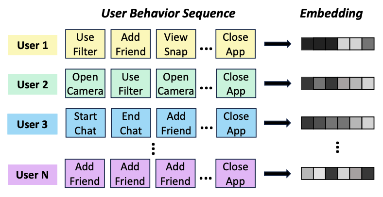
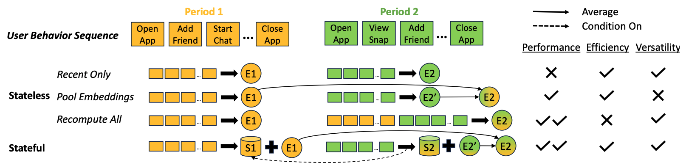

# USE: Dynamic User Modeling with Stateful Sequence Models

The repo contains the official implementation of [USE: Dynamic User Modeling with Stateful Sequence Models](https://arxiv.org/abs/2403.13344)


## Contents

- [1. Introduction](#1-introduction)
- [2. Data](#2-data)
- [3. Setup Environment](#3-setup-environment)
- [4. Pre-Training](#4-pre-training)
- [5. Finetune](#5-finetune)
- [6. Citation](#6-citation)


## 1. Introduction

In this work, we propose User Stateful Embedding (USE), a behavior-based user model that seamlessly integrate historical and recent user behaviors in computing general-purpose user embedding that contains both long-term and short-term user bahevior pattern. We perform comprehensive empirical studies on Snapchat user behavior sequences to verify the effectiveness of USE.








## 2. Data

Due to privacy and legal reasons, we are not able to share the Snapchat user behavior sequence data we used in the paper. To illustrate USE, we use two open-sourced dataset: 

### 2.1 Media Interview

This dataset [1] consists of 463.6K transcripts with abstractive summaries collected from interview transcripts from NPR and CNN. On this dataset, we consider each interview as a user behavior sequence, while each character is a user behavior for simplicity. We train each model for 5 epochs. For evaluation, we keep 5000 sequences aside from model training and consider two dynamic user modeling tasks:

[1] Chenguang Zhu, Yang Liu, Jie Mei, and Michael Zeng. MediaSum: A Large-scale Media Interview Dataset for Dialogue Summarization. NAACL 2021


### Dataset 2.2: Genome sequence

This dataset consists of 2 million DNA sequences from about 30k distinct species. It is not a user modeling dataset, yet we use it to further demonstrate the generalizability of USE. We consider each DNA sequence as a user sequence. We train each model for 1 epoch. In evaluation, we create a dataset with 5000 DNA sequence from 5000 distinct species that are not inlcuded in the training set. We perform the same two tasks as we did above.


The data can be downloaded [here](https://drive.google.com/drive/folders/19nHO3-ub79BHMromChMN8dD1D4Y8Dznp?usp=sharing).


## 3. Setup environment

    # create a virtual python environment from the template
    conda env create -f environment.yml


## 4. Pre-Training

```
export DATA_DIR=/path/to/txt
export DATA_TYPE=dna # choose from ["dialog", "dna"]
export batch_size=42
export min_l=500
export max_l=512
export epoch=6
export gap=50
export learning_rate=4e-4
export gradient_accumulation_steps=2
export model=gpt2
export num_heads=12
export contrastive_embedding=token
export contrastive_type=Orig
export obj=FEP_SUP # select from CLM / FEP / SUP / FEP_SUP
export fep_window_size=5
export fep_context_length=0
export fep_loss_frequency=1
export run_name=retnet_${obj}

python train_user_model.py \
    --run-name ${run_name} \
    --data-dir ${DATA_DIR} \
    --n-iter 1 \
    --num-train-epochs ${epoch} \
    --min-model-input-size ${min_l} \
    --max-model-input-size ${max_l} \
    --user-segments-gap ${gap} \
    --per-device-batch-size ${batch_size} \
    --test-size 0.01 \
    --warmup-ratio 0.06 \
    --learning-rate ${learning_rate} \
    --gradient-accumulation-steps ${gradient_accumulation_steps} \
    --tokenizer-path ./tokenizer/${DATA_TYPE} \
    --model-output-path ./artifacts_${DATA_TYPE}/${run_name}/clm \
    --fep-window-size ${fep_window_size} \
    --eval-steps 50000 \
    --save-steps 500 \
    --cache-dir cache_${DATA_TYPE} \
    --model ${model} \
    --num-heads ${num_heads} \
    --contrastive-embedding ${contrastive_embedding} \
    --contrastive-type ${contrastive_type} \
    --fep-context-length ${fep_context_length} \
    --fep-loss-frequency ${fep_loss_frequency} \
    --get-random-segment \
    --training-objective ${obj}
```


## 5. Evaluation

### 5.1 Dynamic -> User Re-ID


```
export DATA_PATH=/path/to/tsv/file
export DATA_TYPE=dna # choose from ["dialog", "dna"]

python eval_reid.py \
		--model_path /path/to/trained/model \
		--dataset_dir ${DATA_PATH} \
		--tokenizer_path ./tokenizer/${DATA_TYPE}
```


### 5.2 Dynamic -> User Classification

```
export DATA_PATH=/path/to/tsv/file
export DATA_TYPE=dna # choose from ["dialog", "dna"]

python eval_classification.py \
		--model_path /path/to/trained/model \
		--dataset_dir ${DATA_PATH} \
		--tokenizer_path ./tokenizer/${DATA_TYPE}
```


## 6. Citation

If you have any question regarding our paper or codes, please feel free to start an issue or reach out the authors.


If you use USE in your work, please kindly cite our paper:

```
@misc{zhou2024use,
      title={USE: Dynamic User Modeling with Stateful Sequence Models}, 
      author={Zhihan Zhou and Qixiang Fang and Leonardo Neves and Francesco Barbieri and Yozen Liu and Han Liu and Maarten W. Bos and Ron Dotsch},
      year={2024},
      eprint={2403.13344},
      archivePrefix={arXiv},
      primaryClass={cs.SI}
}
```

